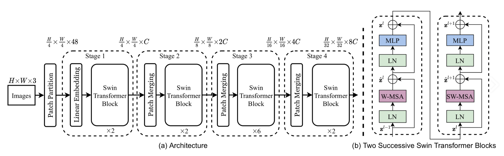

#### **ViT**의 문제점

- classification으로만 제안된 모델
- 이미지를 위한 특성이 없음
- `token` 수에 따른 연산량이 quadratic하게 증가

#### 기존의 NLP에서 사용되는 `transformer`의 이론을 Computer Vision에서 적용하기 힘든 점

- Large variations in the scale of visual entities
- High resolution of pixels in images

결국에는 text가 아니라 image이기 때문에 발생하는 computation cost가 문제!

이에 대해서 **Swin Transformer**는 위와 같이 

- **ViT**와 다르게 계층마다 다른 patch size를 적용하고 merge
- `class token`을 사용하지 않음

$$
\Omega(MSA) = 4hwC^2 + 2(hw)^2C, \\ 
\Omega(W-MSA) = 4hwC^2 + 2M^2hwC 
$$

## Architecture

### Patch partition + Linear embedding

- **ViT**는 16x16의 patch였지만, **Swin Transformer**는 `tiny`기준으로 4x4의 패치를 
사용한다. 

### Swin transformer block

#### `W-MSA`

window로 잘라서 window 내부의 sequence끼리 attetion 진행

#### `SW-MSA`

window를 shift하면서 `W-MSA` 진행

