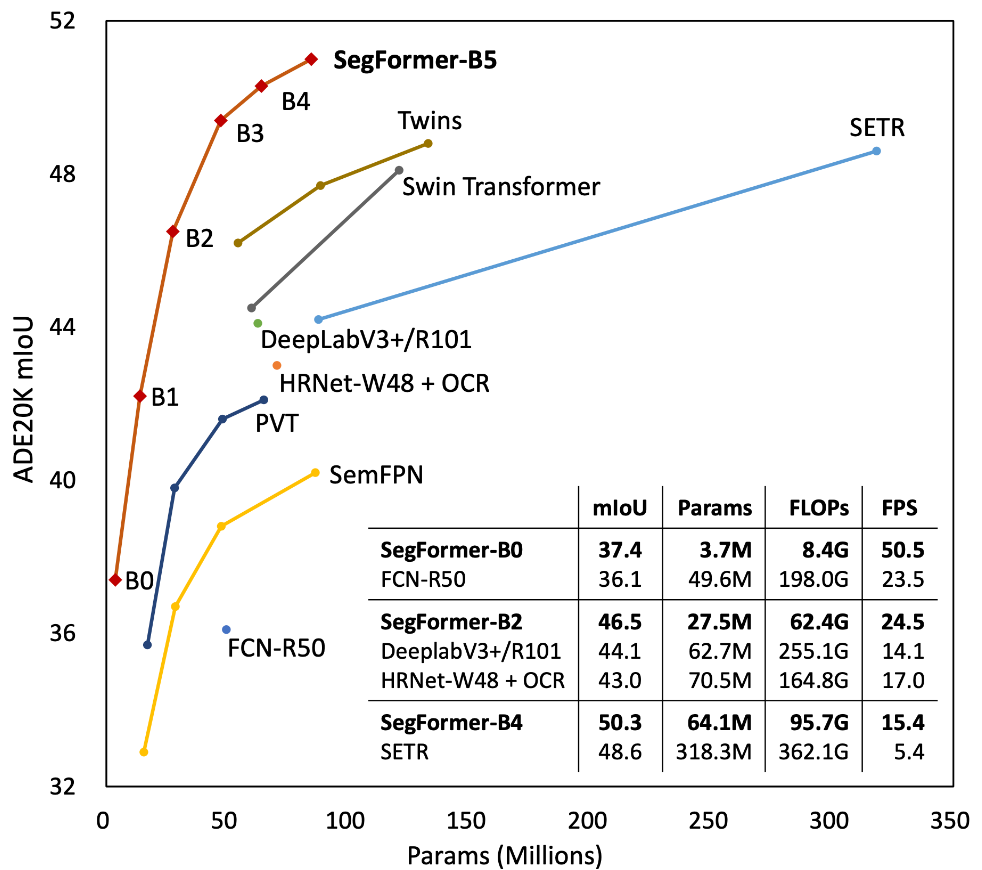
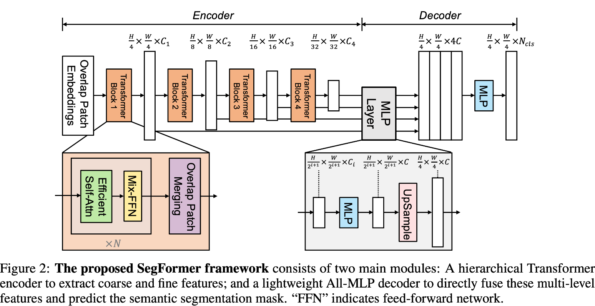

## SegFormer

- Structured transformer encoder generating multi-scale features
- No use of positional encoding then
    - This will improve the performance when the input image has different resolution from training

### Architecture

## References:
- https://github.com/FrancescoSaverioZuppichini/SegFormer